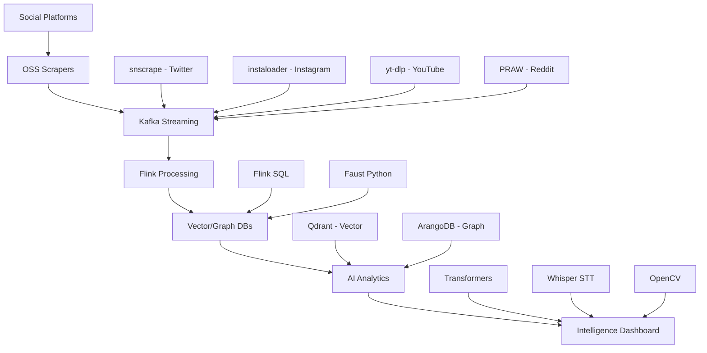

# Architecture Blueprint - OSIN Intelligence Platform

This document outlines the high-level architecture of the OSIN platform and provides a visual overview of the data flow and component interactions.

## System Architecture Diagram

## Architectural Design Principles

1.  **Component-Based Architecture**: Leveraging best-in-class OSS components for every layer to ensure robustness and rapid development.
2.  **Streaming-First Design**: Utilizing high-performance streaming backbones (Kafka/Redpanda) to provide real-time intelligence feeds.
3.  **Modular Development**: Designed to evolve from an MVP to a fully production-ready enterprise-grade system.
4.  **Open Standards**: Focused on extensibility and avoiding vendor lock-in through the use of open-source standards and frameworks.
## Component Selection Matrix

| Layer | Primary Choice | Alternative | Rationale |
| :--- | :--- | :--- | :--- |
| Twitter Ingestion | **snscrape** | Tweepy API | No limits vs official API |
| Instagram | **instaloader** | Custom playwright | Most robust solution |
| YouTube | **yt-dlp** | youtube-dl | More active development |
| Streaming | **Apache Kafka + Strimzi** | Redpanda | Industry standard |
| Processing | **Apache Flink** | Faust | Enterprise capability |
| Vector DB | **Qdrant** | Weaviate | Performance balance |
| Graph DB | **ArangoDB** | JanusGraph | Multi-model flexibility |
| NLP | **HuggingFace** | spaCy | SOTA models |
| Speech | **Whisper** | SpeechRecognition | Best accuracy |
| Vision | **OpenCV + DeepFace** | MediaPipe | Comprehensive |

## Implementation Roadmap

### Phase 1: MVP (Months 1-3)
**Goal**: Core Ingestion Pipeline
- **Stack**: snscrape, instaloader, PostgreSQL + pgvector, Faust
- **Success**: 10K+ events/day, <30s processing.

### Phase 2: V2 (Months 4-6)
**Goal**: Advanced Analytics
- **Stack**: Transformers, Whisper STT, Qdrant, ArangoDB, Apache Flink
- **Focused Features**: Cross-platform correlation, Trend analysis.

### Phase 3: V3 (Months 7-12)
**Goal**: Enterprise-Grade Platform
- **Stack**: Tor routing, Kubernetes scaling, Global deployment, RBAC, Audit Logging
- **Success**: 1M+ events/day, <5s processing, 99.9% uptime.

- **Success**: 1M+ events/day, <5s processing, 99.9% uptime.

## Infrastructure Scaling

| Phase | Infrastructure | Cost Estimate | Team Size |
| :--- | :--- | :--- | :--- |
| MVP | Single server + Docker | $200/month | 2 developers |
| V2 | Small K8s cluster | $1,000/month | 4 developers |
| V3 | Multi-region K8s | $5,000+/month | 8+ developers |

## Development Effort

- **MVP**: 3-4 months (Core Ingestion, Streaming, Basic Dashboard)
- **V2**: 4-5 months (AI Integration, Advanced Analytics, Scale Optimization)
- **V3**: 6-8 months (Enterprise Features, Global Deployment, Advanced Security)

- **V3**: 6-8 months (Enterprise Features, Global Deployment, Advanced Security)

## Critical Considerations

### Security Requirements
- **Data Protection**: Encryption at rest/transit, Secure API key management, Regular audits.
- **Privacy Compliance**: GDPR compliance, Data minimization, User consent mechanisms.
- **Legal Compliance**: TOS adherence, Rate limiting compliance, Copyright respect.

---
Refer to [Strategic Plan](file:///c:/Users/User/Documents/OSIN/secure/osin/strategic_plan.py), [Component Analysis](file:///c:/Users/User/Documents/OSIN/secure/osin/component_analysis.py), [Roadmap](file:///c:/Users/User/Documents/OSIN/secure/osin/roadmap.py), and [Compliance](file:///c:/Users/User/Documents/OSIN/secure/osin/compliance.py) for more details.
